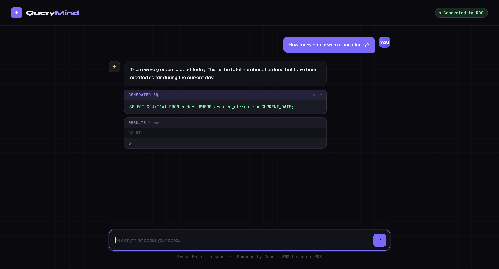

# querymind
# QueryMind — Plain English to SQL

Ask your database anything in plain English. QueryMind automatically writes the SQL, runs it, and explains the results — no SQL knowledge needed.

🔗 **Live Demo:** [your-username.github.io/querymind](https://your-username.github.io/querymind)

---
## Preview



## What it does

Type a question like *"How many orders were placed today?"* and QueryMind:

1. Sends your question to an AI (Groq + Llama 3.3 70B)
2. AI writes the correct SQL query automatically
3. SQL runs on your PostgreSQL database (Amazon RDS)
4. AI explains the results in plain English
5. You get a human-friendly answer in ~2 seconds

---

## Architecture

```
User (Browser)
      │
      │  POST {"question": "How many orders today?"}
      ▼
┌─────────────────────┐
│   GitHub Pages      │  ← Static HTML frontend (free)
│   index.html        │
└─────────┬───────────┘
          │  HTTP POST
          ▼
┌─────────────────────┐
│   API Gateway       │  ← AWS REST endpoint (free tier)
│   /dev/query        │    ap-south-1 (Mumbai)
└─────────┬───────────┘
          │  Triggers
          ▼
┌─────────────────────┐
│  Orchestrator       │  ← AWS Lambda Python 3.12 (free tier)
│  Lambda             │    Coordinates the pipeline
└──────┬──────┬───────┘
       │      │
       │      └──────────────────────────┐
       │  Invokes                        │  Invokes
       ▼                                 ▼
┌─────────────────┐             ┌─────────────────┐
│  SQL Generator  │             │   Summarizer    │
│  Lambda         │             │   Lambda        │
│                 │             │                 │
│  Calls Groq AI  │             │  Calls Groq AI  │
│  → writes SQL   │             │  → plain English│
└────────┬────────┘             └─────────────────┘
         │  Executes SQL
         ▼
┌─────────────────────┐
│   Amazon RDS        │  ← PostgreSQL (free tier)
│   PostgreSQL        │    ap-south-1 (Mumbai)
│   mydb              │
└─────────────────────┘
```

### Request flow

| Step | What happens |
|------|-------------|
| 1 | User types question in browser |
| 2 | Browser sends POST request to API Gateway |
| 3 | API Gateway triggers Orchestrator Lambda |
| 4 | Orchestrator calls SQL Generator Lambda |
| 5 | SQL Generator sends question + schema to Groq AI |
| 6 | Groq writes the SQL query |
| 7 | Lambda executes SQL on RDS PostgreSQL |
| 8 | Orchestrator calls Summarizer Lambda with raw results |
| 9 | Summarizer sends results to Groq AI |
| 10 | Groq explains results in plain English |
| 11 | Answer returns to the browser |

---

## Tech stack

| Layer | Service | Cost |
|-------|---------|------|
| Frontend | GitHub Pages | Free forever |
| API | AWS API Gateway | Free tier (1M req/month) |
| Compute | AWS Lambda × 3 | Free tier (1M req/month) |
| Database | Amazon RDS PostgreSQL | Free tier (750 hrs/month) |
| AI | Groq — Llama 3.3 70B | Free (14,400 req/day) |
| Region | ap-south-1 Mumbai | — |

**Total monthly cost: $0**

---

## Project structure

```
querymind/
├── index.html                  ← Frontend chat UI
├── README.md                   ← This file
└── lambda/
    ├── orchestrator.py         ← Coordinates the pipeline
    ├── sql_generator.py        ← Calls Groq, runs SQL on RDS
    └── summarizer.py           ← Turns results into plain English
```

---

## Lambda functions

### orchestrator.py
Entry point. Receives the question from API Gateway, invokes the SQL Generator Lambda, then invokes the Summarizer Lambda, and returns the final answer.

### sql_generator.py
Builds a prompt using the question + schema description → sends to Groq → receives SQL → executes it on RDS via pg8000 → returns raw results.

### summarizer.py
Takes the original question + raw SQL results → sends to Groq → receives a plain English explanation → returns it.

---

## Environment variables

Each Lambda has these environment variables set in AWS Console:

**sql-generator-lambda:**
| Variable | Description |
|----------|-------------|
| `GROQ_API_KEY` | Your Groq API key (starts with `gsk_`) |
| `DB_HOST` | RDS endpoint URL |
| `DB_NAME` | Database name (`mydb`) |
| `DB_USER` | Master username (`postgres`) |
| `DB_PASSWORD` | Master password |

**summarizer-lambda:**
| Variable | Description |
|----------|-------------|
| `GROQ_API_KEY` | Your Groq API key |

**orchestrator-lambda:**
| Variable | Description |
|----------|-------------|
| `SQL_LAMBDA` | `sql-generator-lambda` |
| `SUMMARY_LAMBDA` | `summarizer-lambda` |
| `GROQ_API_KEY` | Your Groq API key |

---

## Database schema

```sql
CREATE TABLE products (
    id SERIAL PRIMARY KEY,
    name VARCHAR(100),
    category VARCHAR(50),
    price NUMERIC(10,2),
    stock INT
);

CREATE TABLE orders (
    id SERIAL PRIMARY KEY,
    customer_name VARCHAR(100),
    product VARCHAR(100),
    quantity INT,
    price NUMERIC(10,2),
    created_at TIMESTAMP DEFAULT CURRENT_TIMESTAMP
);
```

---

## API

**Endpoint:**
```
POST https://YOUR-API-ID.execute-api.ap-south-1.amazonaws.com/dev/query
```

**Request:**
```json
{
  "question": "How many orders were placed today?"
}
```

**Response:**
```json
{
  "answer": "There were 3 orders placed today.",
  "sql": "SELECT COUNT(*) FROM orders WHERE created_at::date = CURRENT_DATE",
  "results": [{ "count": 3 }]
}
```

---

## Local development

To run the frontend locally, just open `index.html` in a browser. Make sure CORS is enabled on your API Gateway first.

To test the Lambda functions directly, use the AWS Lambda console test tab with:
```json
{
  "question": "How many orders were placed today?"
}
```

---

## Getting started

1. **AWS account** — [aws.amazon.com](https://aws.amazon.com) (free tier)
2. **Groq API key** — [console.groq.com](https://console.groq.com) (free, no card needed)
3. Create RDS PostgreSQL instance (free tier, ap-south-1)
4. Deploy three Lambda functions with the code in `/lambda`
5. Create API Gateway POST endpoint → connect to orchestrator Lambda
6. Update `API_URL` in `index.html` with your Gateway URL
7. Deploy `index.html` to GitHub Pages as `index.html`

---

## Example questions

- *"How many orders were placed today?"*
- *"What are the top 5 products by revenue?"*
- *"Which customer spent the most money?"*
- *"Show me all orders from the last 2 days"*
- *"What is the total revenue this month?"*
- *"How many products do we have in stock?"*

---

## Security notes

- All credentials are stored as Lambda environment variables — never in code
- The API URL is public but contains no secrets
- Only SELECT queries are allowed — the AI prompt explicitly forbids INSERT, UPDATE, DELETE, DROP
- RDS is in a private VPC with security group restricting port 5432 access

---

## Built with

- [AWS Lambda](https://aws.amazon.com/lambda/) — serverless compute
- [Amazon RDS](https://aws.amazon.com/rds/) — managed PostgreSQL
- [AWS API Gateway](https://aws.amazon.com/api-gateway/) — REST API
- [Groq](https://groq.com/) — fast AI inference
- [Llama 3.3 70B](https://llama.meta.com/) — open source LLM by Meta
- [pg8000](https://github.com/tlocke/pg8000) — pure Python PostgreSQL driver
- [GitHub Pages](https://pages.github.com/) — static hosting
